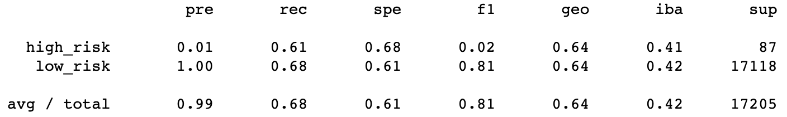
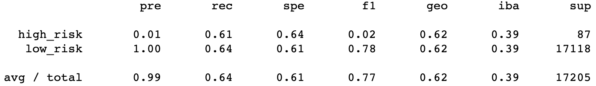
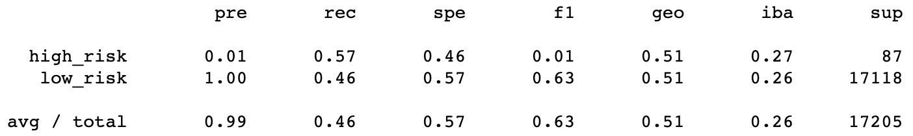
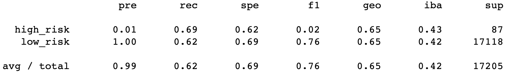
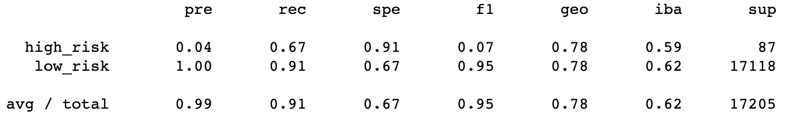
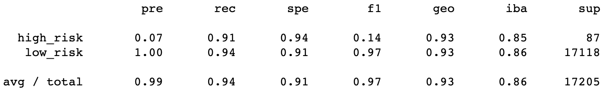

# Overview
### Credit Risk Analysis
The purpose of this analysis is to build and evaluate machine learning models with Python to predict credit risk. 

We use four algorithms to resample the data and train the LogisticRegression model. We also train two different ensemble classifiers. Then we compare the performance of each model to predict credit risk.

### Resources
- Lending Club data from the first quarter of 2019
- The imbalanced-learn and scikit-learn libraries

# Results

RandomOverSampler oversampling 
- Accuracy 0.65
- Precision
    - High-risk: 0.01
    - Low-risk: 1.00
- Recall
    - High-risk: 0.61
    - Low-risk: 0.68

SMOTE oversampling
- Accuracy 0.62
- Precision
    - High-risk: 0.01
    - Low-risk: 1.00
- Recall
    - High-risk: 0.61
    - Low-risk: 0.64

ClusterCentroids undersampling
- Accuracy 0.52
- Precision
    - High-risk: 0.01
    - Low-risk: 1.00
- Recall
    - High-risk: 0.57
    - Low-risk: 0.46

SMOTEENN over- and undersampling
- Accuracy 0.65
- Precision
    - High-risk: 0.01
    - Low-risk: 1.00
- Recall
    - High-risk: 0.69
    - Low-risk: 0.62

BalancedRandomForestClassifier
- Accuracy 0.79
- Precision
    - High-risk: 0.04
    - Low-risk: 1.00
- Recall
    - High-risk: 0.67
    - Low-risk: 0.91

EasyEnsembleClassifier
- Accuracy 0.92
- Precision
    - High-risk: 0.07
    - Low-risk: 1.00
- Recall
    - High-risk: 0.91
    - Low-risk: 0.94

# Summary
The EasyEnsembleClassifer model provides the highest precision and recall of predicting high-risk credit.

 Precision of 0.07 indicates 7% of classified high-risk credit is actually high-risk, and recall of 0.91 indicates 91% of actual high-risk credit was classified correctly. This is recommended as the best-performing model for this dataset and purpose of analysis.